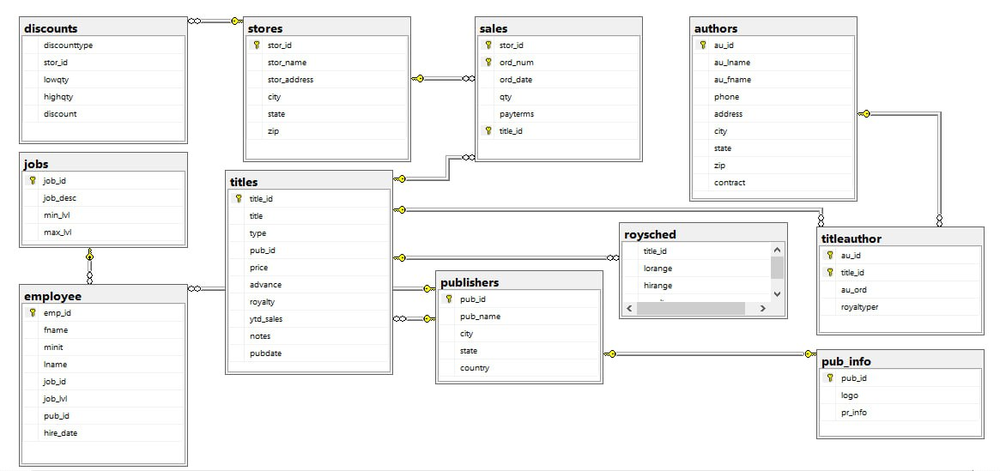

# SQL Project with Pubs Database

This SQL project explores the classic Microsoft **Pubs** sample database. It features a collection of queries and scripts designed to demonstrate core SQL skills through real-world scenarios.

## 📌 Overview

The project focuses on essential SQL concepts, including:

- Data retrieval using `SELECT` statements
- Filtering with `WHERE`, `LIKE`, `IN`, and `BETWEEN`
- Sorting and ordering data
- Table joins (INNER, LEFT, RIGHT)
- Aggregation using `GROUP BY` and `HAVING`
- Subqueries and nested queries
- Working with **Linked Servers** in SQL Server

The aim is to provide clear, practical examples of how SQL can be used to explore and analyze relational data in a structured and meaningful way.

## 📘 Pubs Database Relational Diagram

### The diagram below shows the relationships between key tables in the classic Pubs database, including `authors`, `titles`, `publishers`, and their junction tables.

---

## 📂 Repository Structure

📁 /queries │ ├── 01_basic_select.sql │ ├── 02_joins_and_aggregations.sql │ ├── 03_subqueries.sql │ └── 04_linked_server_queries.sql

📁 /docs │ ├── pubs_erd.png │ └── pubs_table_structure.md

## 🧰 Tech Stack

- Microsoft SQL Server
- SQL Server Management Studio (SSMS)
- Git + GitHub
  
## ✅ Use Cases

This project is suitable for:
- Practicing intermediate SQL skills

- Demonstrating SQL knowledge to potential employers

- Understanding cross-server querying via Linked Servers

- Exploring a relational dataset with well-defined entities

 ## 📬 Contact
Feel free to connect with me on LinkedIn  https://www.linkedin.com/in/shiva-bajelan-4443722a5/ if you have questions, suggestions, or just want to chat about SQL or data analytics. 
